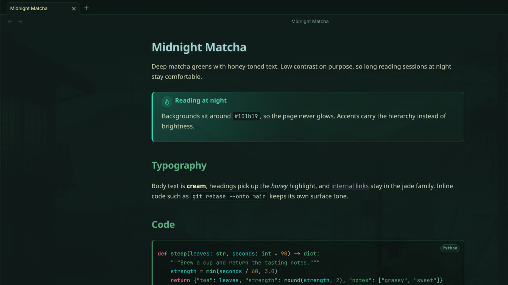
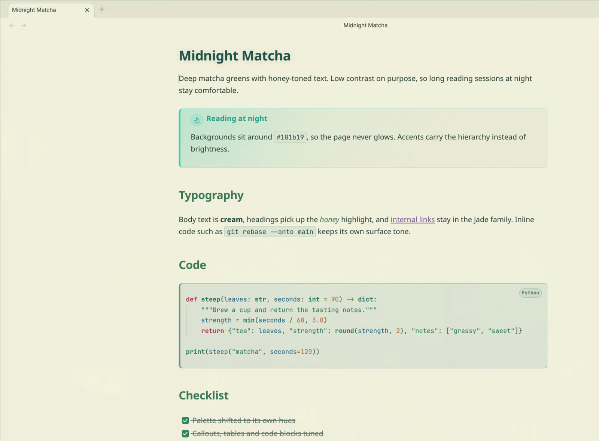

# Midnight Matcha

A dark Obsidian theme built around deep matcha greens and honey-toned text. Low contrast on purpose, so long reading and note-taking sessions at night stay comfortable.

**Dark**

**Light**

## Palette

| Role | Color |
|---|---|
| Dark background | `#101b19` |
| Dark surface | `#22382e` |
| Light paper | `#f7efd0` |
| Light paper surface | `#ebe2c3` |
| Matcha | `#164033` |
| Foam (accent) | `#398667` · `#51a173` |
| Mist | `#aad5d6` |
| Cream (dark-mode text) | `#d4d7bb` |
| Honey (highlight) | `#faf3af` |

Both light and dark modes are supported.

## Install

**From Obsidian:** Settings → Appearance → Themes → Manage → search for "Midnight Matcha".

**Manually:** copy `theme.css` and `manifest.json` into `<vault>/.obsidian/themes/Midnight Matcha/`, then pick the theme in Settings → Appearance.

## License

[MIT](LICENSE)
